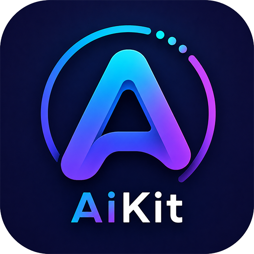
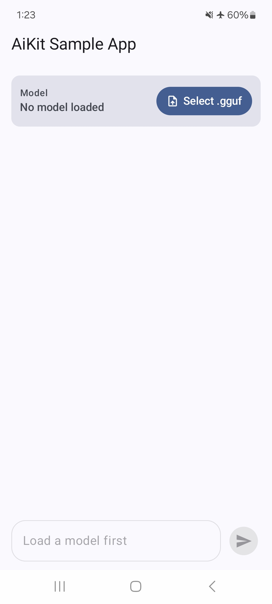
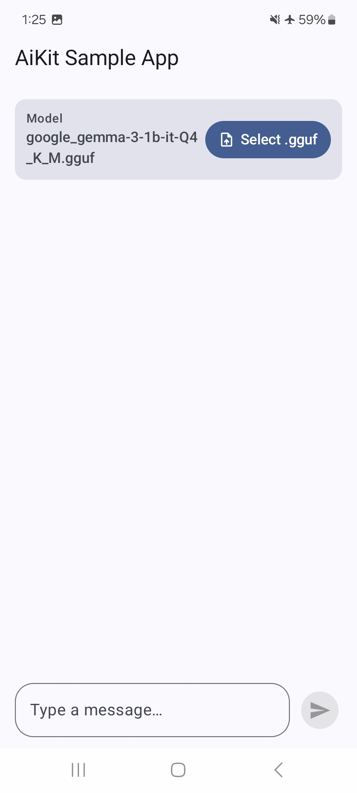
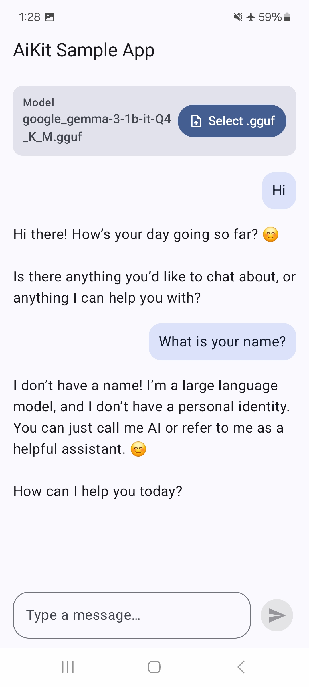

<h1 align="center">🧩 AiKit — On-Device LLM Library for Android</h1>

<p align="center">
  
</p>

<p align="center">
  
  
  
  
</p>

<p align="center">
  <b>A modular Android library for running on-device LLM inference — powered by llama.cpp, exposed through a clean Kotlin API.</b><br/>
  No cloud • No API keys • Fully offline
</p>

<p align="center">

  


</p>

---

## 📑 Table of Contents

- [📱 Overview](#-overview)
- [🎥 Demo](#-demo)
- [🖼️ Screenshots](#-screenshots)
- [✨ Why AiKit](#-why-aikit)
- [📦 Modules](#-modules)
- [🛠 Tech Stack](#-tech-stack)
- [🧠 Architecture](#-architecture)
- [📂 Project Structure](#-project-structure)
- [🚀 Getting Started](#-getting-started)
- [💬 Usage](#-usage)
- [📱 Requirements](#-requirements)
- [🗺️ Roadmap](#️-roadmap)
- [🤝 Contributing](#-contributing)
- [📄 License](#-license)

---

## 📱 Overview

**AiKit** is a modular Android library that brings on-device LLM inference to any Android app with a small, clean Kotlin API.

It's extracted from [Offline AI Assistant](https://github.com/its-hazratbilal/offline-ai-assistant), a production Android app that runs GGUF-based Large Language Models (LLMs) entirely on-device. It has been repackaged as a standalone, reusable library, enabling Android developers to integrate on-device LLM inference into their apps without writing JNI code, managing llama.cpp's lifecycle, or handling native backend loading.

Every inference runs **entirely on-device**. No network calls, no API keys, no data leaving the phone.

---

## 🎥 Demo

> **🎬 Sample App**

https://github.com/user-attachments/assets/6a5c9910-5d62-407f-bd7e-3d5162afe8b6

---

## 📸 Screenshots

<p align="center">
  
  
  
</p>

---

## ✨ Why AiKit

- 🧠 **On-device inference** — powered by `llama.cpp`, no cloud dependency
- 🧩 **Modular by design** — pull in only the capability you need (`core`, `chat`, more coming)
- 🎯 **Minimal public API** — call to load a model and start chatting
- 🔄 **Streaming-first** — token-by-token callbacks for real-time UI updates
- 🔧 **DI-framework agnostic** — no Hilt/Koin forced on consumers; plain constructors and factory methods
- 📦 **Published on Maven Central** — simple dependency management with Gradle

---

## 📦 Modules

| Module | Responsibility |
|--------|-----------------|
| `android-ai-kit-core` | Model loading, lifecycle management, JNI bridge to llama.cpp |
| `android-ai-kit-chat` | Stateless chat/completion API with streaming token callbacks |
| `android-ai-kit-rag` *(planned)* | Retrieval-augmented generation — embeddings + vector search |
| `android-ai-kit-vision` *(planned)* | Multimodal / image-input support |

Each capability module depends only on `core` — add just what your app needs.

---

## 🛠 Tech Stack

| Technology | Purpose |
|------------|----------|
| Kotlin | Public API surface |
| Kotlin Coroutines & Flow | Async model loading, token streaming |
| llama.cpp | Local LLM inference engine |
| C++ / JNI | Native AI integration |
| GGUF Models | Quantized on-device AI models |
| Gradle Multi-Module | `core` / `chat` modular publishing |
| Maven Central | Library distribution |

---

## 🧠 Architecture

```text
Consumer App
      │
      ▼
AiKitEngine (core)  ──────────────►  AiKitChat (chat)
      │                                      │
      ▼                                      ▼
ModelManager                          engine.chat()
      │
      ▼
LlmEngine (interface)
      │
      ▼
LlamaCppEngine (JNI bridge)
      │
      ▼
llama.cpp
      │
      ▼
GGUF Model
```

`AiKitEngine` is the single entry point for model lifecycle. Capability modules like `AiKitChat` are obtained via extension functions (`engine.chat()`) rather than constructed directly — keeping `core` unaware of any module built on top of it.

---

## 📂 Project Structure

```text
android-ai-kit
│
├── core
│   ├── engine
│   ├── gguf
│   │   └── internal
│   ├── manager
│   ├── model
│   ├── AiKitEngine.kt
│   └── InternalAiKitApi.kt
│
├── chat
│   ├── AiKitChat.kt
│   └── AiKitEngineExtensions.kt
│
├── sample
│   ├── model
│   ├── state
│   ├── ui
│   │   └── theme
│   ├── ChatActivity.kt
│   └── ChatViewModel.kt
```

---

## 📦 Package Overview

| Package | Responsibility |
|----------|----------------|
| **core / engine** | JNI bridge to llama.cpp, native model loading |
| **core / manager** | Model lifecycle, state transitions, error recovery |
| **core / gguf** | GGUF file metadata reading |
| **core / model** | Request/response data classes |
| **chat** | Stateless chat API, streaming callbacks, and the `engine.chat()` extension entry point |
| **sample** | Minimal reference app demonstrating the library end-to-end |

---

## 🏗️ Design Principles

- **Single entry point per module** — `AiKitEngine.create(context)`, `engine.chat()`; no public constructors for internals
- **`internal` by default** — only what's meant to be consumed publicly is exposed
- **No forced DI framework** — works with Hilt, Koin, manual DI, or none at all
- **Stateless chat** — no history/session management inside the library; consumers own that layer
- **Streaming-native** — every generation call exposes a token `Flow` under the hood

AiKit focuses solely on on-device LLM inference. Conversation history, prompt management, persistence, and UI remain the responsibility of the host application.

---

## 🚀 Getting Started

### Add the dependencies

```kotlin
// app/build.gradle.kts
dependencies {
    implementation("io.github.its-hazratbilal:android-ai-kit-core:1.0.0")
    implementation("io.github.its-hazratbilal:android-ai-kit-chat:1.0.0")
}
```

### Required app-level packaging config

AiKit uses dynamic CPU backend loading for llama.cpp. Consuming apps **must** add this to their own `build.gradle.kts`, or model loading will fail with `no backends are loaded`:

```kotlin
android {
    packaging {
        jniLibs {
            useLegacyPackaging = true
        }
    }
}
```

---

## 💬 Usage

### Load a model

```kotlin
val engine = AiKitEngine.create(context)

engine.loadModel(modelFilePath, object : AiKitEngine.ModelStateListener {
    override fun onModelLoading() { /* Show loading */ }
    override fun onModelLoaded() { /* Ready to chat */ }
    override fun onModelError(error: Throwable) { /* Handle error */ }
    override fun onModelUnloaded() { /* Cleanup */ }
})
```

### Check and manage model state

```kotlin
val isLoaded = engine.isModelLoaded()

val path = engine.currentModelPath()

engine.unloadModel()
```

### Send a message and stream the response

```kotlin
val chat = engine.chat()

chat.sendMessage(prompt, listener = object : AiKitChat.ChatListener {
    override fun onGenerationStarted() { /* Show loading */ }
    override fun onToken(token: String) { /* Update UI */ }
    override fun onGenerationComplete(fullResponse: String) { /* Display final response */ }
    override fun onGenerationError(error: Throwable) { /* Handle error */ }
    override fun onCancelled() { /* Generation cancelled */ }
})
```

### Cancel an in-progress generation

```kotlin
chat.cancelGeneration()
```

A full working example — including a `.gguf` file picker and a streaming chat UI in Jetpack Compose — is in the [`sample`](./sample) module.

---

## 📱 Requirements

| Requirement | Recommended |
|-------------|-------------|
| Android Version | Android 11 (API 30)+ |
| RAM | 4 GB minimum (8 GB recommended for larger models) |
| Storage | Depends on chosen GGUF model size |

---

## 🧠 Supported Models

AiKit works with **GGUF models supported by `llama.cpp`**, including:

- **Gemma**
- **Llama**
- **Qwen**
- **Phi**
- **TinyLlama**
- **Mistral**

> **Note:** Model compatibility depends on the version of `llama.cpp` bundled with AiKit. Any GGUF model supported by that version of `llama.cpp` should work.

---

## 🗺️ Roadmap

- [x] `core` — model loading & lifecycle
- [x] `chat` — streaming chat API
- [ ] `rag` — retrieval-augmented generation
- [ ] `vision` — multimodal / image input
- [ ] KMP support (Android + Desktop)

---

## 🤝 Contributing

Contributions are always welcome!

If you'd like to improve the library:

1. Fork the repository
2. Create a feature branch

```bash
git checkout -b feature/my-feature
```

3. Commit your changes

```bash
git commit -m "Add amazing feature"
```

4. Push the branch

```bash
git push origin feature/my-feature
```

5. Open a Pull Request

---

## 🎯 What This Project Demonstrates

- 📦 Designing and publishing a **modular Android library**
- 🤖 On-device LLM inference using **llama.cpp**
- 📦 Native C++ integration through **JNI**, including dynamic CPU backend loading
- 🧩 Clean public API design — restricted constructors, extension-function entry points
- ⚡ Streaming architecture with **Kotlin Coroutines & Flow**
- 🔧 Framework-agnostic library design (no forced DI, no forced persistence layer)
- 🚀 Distribution via **JitPack**

---

## 🙏 Acknowledgements

- **llama.cpp** — fast, efficient on-device LLM inference
- **GGUF** — standard format for quantized language models
- **Hugging Face** — model hosting and distribution

---

## 👨‍💻 Author

**Hazrat Bilal**  
Senior Android Engineer  
Kotlin • Jetpack Compose • MVVM • Clean Architecture • Kotlin Multiplatform (KMP) • Flutter

[](https://hazratbilal.com)
[](https://github.com/its-hazratbilal)
[](https://linkedin.com/in/its-hazratbilal)

---

## ⭐ Support

If you found this library useful, please consider supporting it by:

- ⭐ Starring the repository
- 🍴 Forking the library
- 🐛 Reporting bugs
- 💡 Suggesting new features
- 🔀 Opening Pull Requests
- 📢 Sharing the library with other Android developers

Every contribution and star helps the project grow.

---

## 📄 License

This project is licensed under the **MIT License**.

See the [LICENSE](LICENSE) file for details.

---

Built with ❤️ using Kotlin, Coroutines, and llama.cpp
